# image_stitch

从 `image_stitching` 项目中独立整理出的完整点线单应性图像拼接流程：

```text
OmniGlue 点匹配 ─┐
                 ├─ 稳健初值 ─ 匹配过滤 ─ 点线联合优化 ─ 单应投影 ─ 羽化融合
LineTR 线匹配 ───┘
```

本仓库不包含深度估计、RAFT 光流、运动区域三分区或视频同步，但保留了单应性估计本身的完整点线匹配能力。下面提交的输入和输出均来自原项目中的三个真实场景，不是合成图。

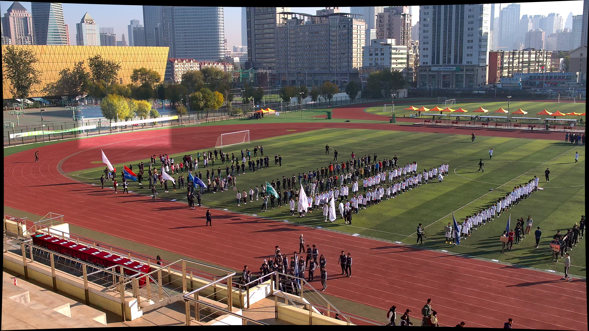

## 功能

- [OmniGlue](https://github.com/google-research/omniglue) 跨视角点匹配；
- [LineTR](https://github.com/yosungho/LineTR) 的 LSD 线段检测、描述与匹配；
- RANSAC 点匹配初值与线约束后备初值；
- 基于重投影距离和方向角的线匹配过滤；
- 点重投影误差 + 采样点到线误差的 8 自由度联合优化；
- Huber 鲁棒权重和点线匹配置信度权重；
- 直接估计 `H`，或从已有 `H_init` 估计 `H_delta` 并生成 `H_final`；
- 自动画布、有效掩膜和有限宽度的 local 边缘羽化融合；
- 保存矩阵、匹配数量、RMSE 以及点线匹配可视化。

算法和坐标变换的详细说明见 [docs/algorithm.md](docs/algorithm.md)。

## 输入和输出

三个真实样例都采用初值精修模式。每个样例目录的输入含义如下：

| 文件 | 含义 |
| --- | --- |
| `input/local.jpg` | 源图：局部相机拍摄的高分辨率、较窄视角图像 |
| `input/global.jpg` | 目标/参考图：全局相机拍摄并已去畸变的宽视角图像 |
| `input/H_init.npz` | 原项目标定得到的粗单应性初值，文件内矩阵键为 `H` |

这里提交的三份 `H_init.npz` 均由原项目的相机内外参与地面参数直接重新计算。原项目 `to_yy` 目录中的同场景 `H_*.npz` 实际保存的是已经经过点线优化的 `H_final`，因此没有将它们作为初值使用。

坐标方向始终是从 local 到 global：

```text
p_global ~ H_final @ p_local
H_final = H_delta @ H_init
```

程序先用 `H_init` 将 local 投到 global 坐标系，在有效重叠区域执行 OmniGlue 点匹配和 LineTR 线匹配，再联合优化增量 `H_delta`。每个样例的输出目录包含：

| 文件 | 含义 |
| --- | --- |
| `output/panorama.jpg` | 用 `H_final` 投影并羽化融合后的最终图像 |
| `output/initial_warp.jpg` | 只用 `H_init` 投影 local 的原始全尺寸结果；投影区域外为黑色 |
| `output/initial_alignment.jpg` | 清晰版初值可视化：左侧在 global 中定位投影区域，右侧显示放大的 local/global 叠加细节 |
| `output/final_alignment.jpg` | 清晰版最终可视化：左侧在完整 panorama 中定位最终覆盖区域，右侧放大真实的羽化融合结果 |
| `output/point_line_matches.jpg` | 裁到投影 ROI 后的点线匹配可视化，展示尺寸不再受 global 全画布影响 |
| `output/metadata.json` | 输入路径、初值和最终投影 ROI、`H_init`、`H_delta`、`H_final`、画布、匹配数量、RMSE 和迭代次数 |

这些样例中 local 的视野包含在 global 的部分区域内，因此输出是 global 坐标系下的 `3840 × 2160` 融合图，而不是左右并排、横向扩展的传统全景图。

`initial_alignment.jpg` 左侧青色轮廓表示 local 经 `H_init` 投影后的实际边界，黄色矩形表示带 32 px 留白的可视化 ROI；右侧将这个 ROI 放大，并按照 local 55%、global 45% 叠加。这样既保留全局位置关系，也能直接观察初值附近的重影和对齐误差。

`final_alignment.jpg` 使用同样的布局，但基于 `H_final` 和实际羽化融合结果生成：左侧是带定位框的完整最终画布，右侧是黄色框对应的最终融合像素，并且不再叠加青色或黄色边框。原始无标注大图仍保存在 `panorama.jpg`，三个样例的尺寸均为 `3840 × 2160`。

默认只在 local 投影边缘内侧 32 px 范围进行羽化：边界处由 global 平滑过渡，离开边界 32 px 后 local 权重达到 100%。可通过 `--feather-width` 调整过渡宽度；设为 `0` 表示不羽化、直接覆盖。

## 三个真实场景样例

### 1. 运动场：`20201024084037322_cam11`

不同相机视角下的室外运动场。最终保留 330/335 个点匹配和 68/74 个线匹配；点 RMSE 为 1.580 px，线 RMSE 为 1.831 px。相对于相机标定得到的 `H_init`，`H_final` 在 local 全图网格上的平均修正为 54.27 px，最大修正为 70.93 px。

| local 输入 | global 输入 |
| --- | --- |
| 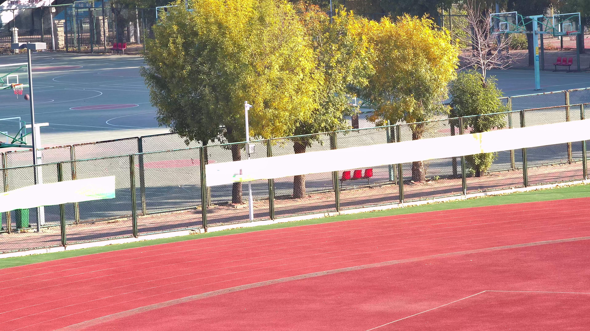 |  |

#### 初值定位及局部放大

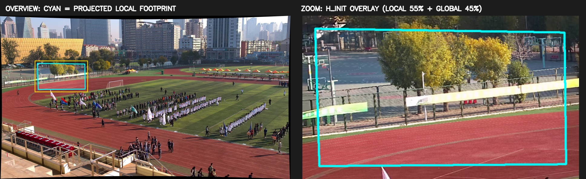

#### 最终融合定位及局部放大

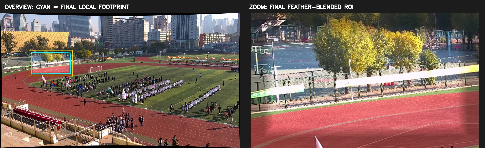

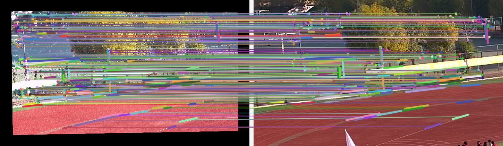

### 2. 室内展厅：`20210313151132256_cam22`

不同相机视角下的室内展厅。最终保留 629/630 个点匹配和 119/121 个线匹配；点 RMSE 为 1.284 px，线 RMSE 为 1.118 px。相对于相机标定得到的 `H_init`，`H_final` 在 local 全图网格上的平均修正为 21.29 px，最大修正为 32.62 px。

| local 输入 | global 输入 |
| --- | --- |
| 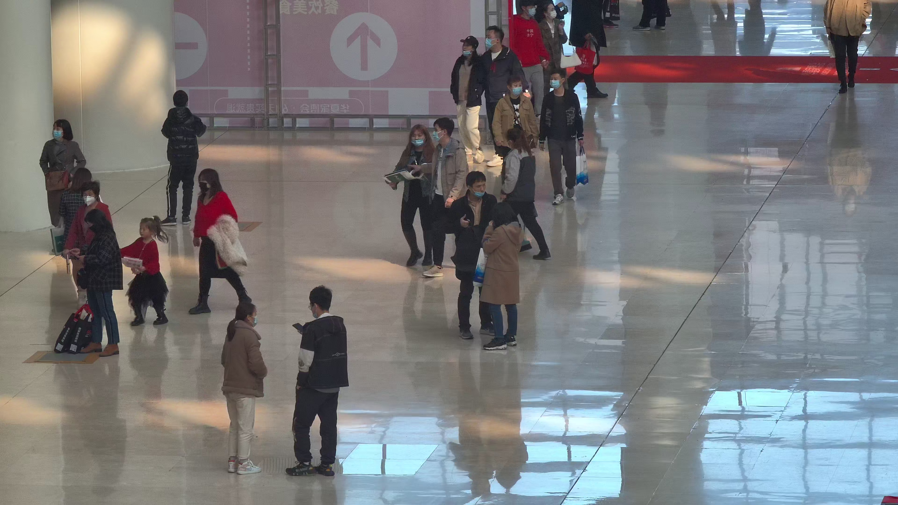 | 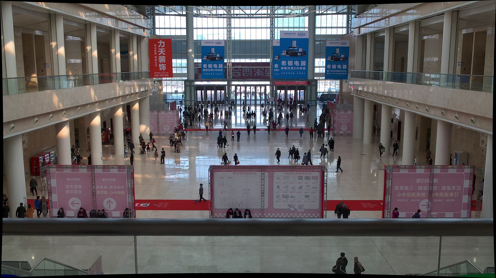 |

#### 初值定位及局部放大

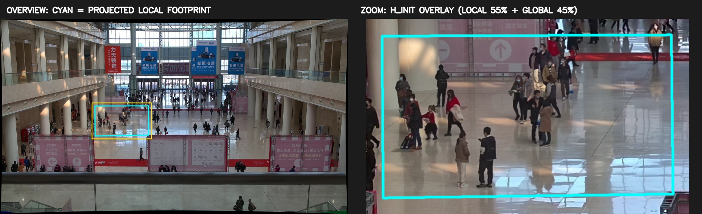

#### 最终融合定位及局部放大

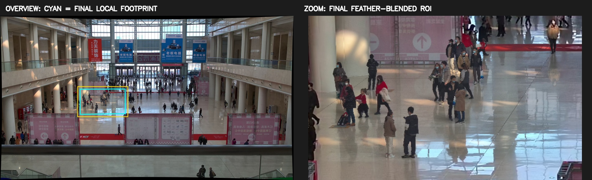

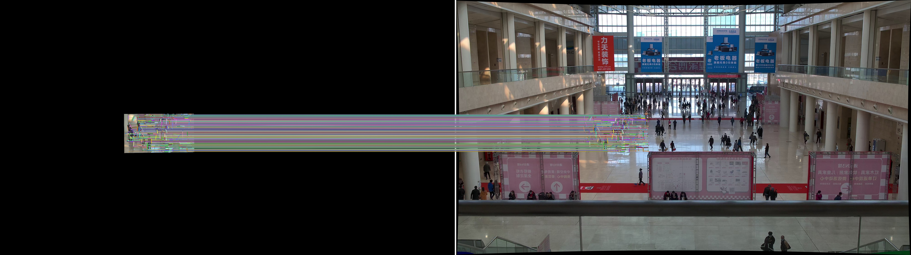

### 3. 校园道路：`20220817171240976_cam35`

不同相机视角下的室外校园道路。最终保留 389/433 个点匹配和 79/79 个线匹配；点 RMSE 为 1.695 px，线 RMSE 为 1.400 px。相对于相机标定得到的 `H_init`，`H_final` 在 local 全图网格上的平均修正为 71.66 px，最大修正为 86.91 px。

| local 输入 | global 输入 |
| --- | --- |
| 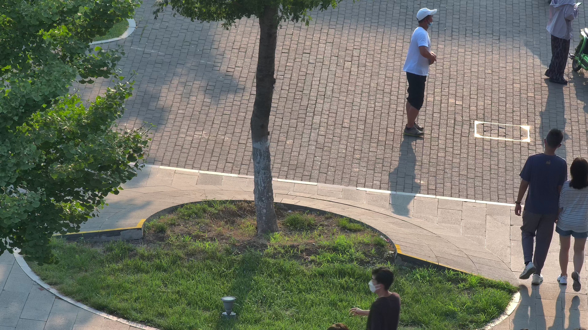 | 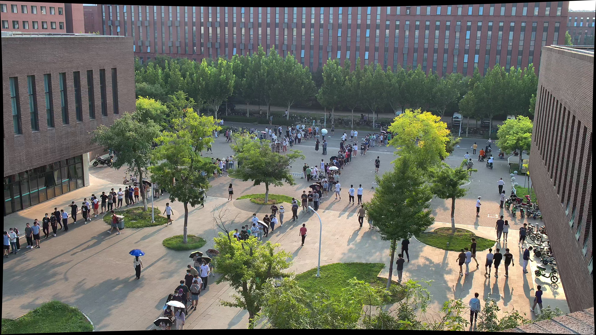 |

#### 初值定位及局部放大

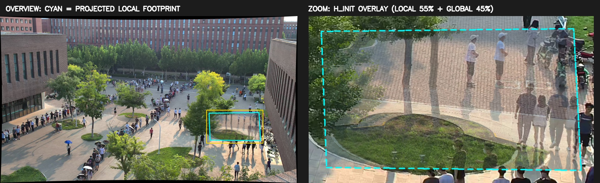

#### 最终融合定位及局部放大

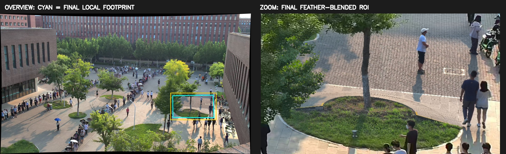

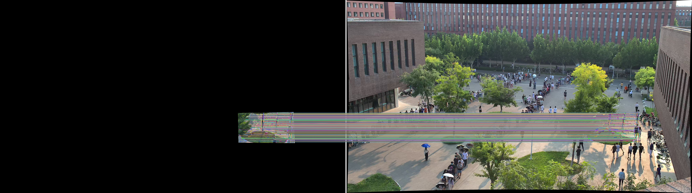

## 安装

项目支持 Python 3.10–3.12。OmniGlue 模型约 400 MB，首次安装需要下载。

```bash
git clone --recursive https://github.com/liuyuxiang1021/image_stitch.git
cd image_stitch
conda env create -f environment.yml
conda activate image_stitch
bash scripts/setup_models.sh
```

已有环境也可以直接运行：

```bash
git submodule update --init --recursive
bash scripts/setup_models.sh
```

`setup_models.sh` 安装本项目及 OmniGlue，并使用 OmniGlue 官方说明中的地址下载 SuperPoint、DINOv2 和 OmniGlue 权重。LineTR 及其官方权重由 Git submodule 固定版本提供。默认自动使用 CUDA；没有可用 GPU 时使用 CPU，但模型推理会明显更慢。

## 运行真实样例

以运动场样例为例，在仓库根目录运行：

```bash
example=examples/20201024084037322_cam11

image-stitch \
  "$example/input/local.jpg" \
  "$example/input/global.jpg" \
  --initial-h "$example/input/H_init.npz" \
  --output "$example/output/panorama.jpg" \
  --artifacts-dir "$example/output"
```

将 `example` 改为下面任一目录即可复现另外两个场景：

```text
examples/20210313151132256_cam22
examples/20220817171240976_cam35
```

运行会覆盖对应目录内已提交的输出。不同 GPU、CUDA/cuDNN 或依赖版本可能造成末位数值差异。

## 直接估计模式

对于两幅视角和尺度差异不大、重叠区域足够的图像，也可以不提供初值，直接通过点线匹配估计单应性：

```bash
image-stitch source.jpg destination.jpg \
  --output panorama.jpg \
  --artifacts-dir output
```

三个仓库样例的 local/global 尺度和视角差异较大，所以使用原项目的 `H_init` 做重叠区域定位，再进行完整的点线匹配精修。

`H_init` 支持以下格式：3×3 `.npy`；含 `H_init`、`homography` 或 `H` 键的 `.npz`；JSON 形式的 3×3 数组或含上述字段的对象。

## 常用参数

```text
--confidence 0.1                OmniGlue 置信度阈值
--max-match-width 1200          匹配阶段的最大图像宽度，0 表示不缩放
--point-weight 0.5              点残差权重
--line-weight 0.5               线残差权重
--ransac-threshold 4.0          点 RANSAC 阈值（匹配尺度像素）
--line-distance-threshold 12.0  线中点到目标直线阈值
--line-angle-threshold 15.0     线方向差阈值（度）
--feather-width 32              local 边缘羽化宽度（输出像素），0 表示直接覆盖
--feather-power 1.0             羽化曲线指数
--device auto                   auto / cpu / cuda
--gpu 0                         同时提供给 TensorFlow 与 PyTorch 的物理 GPU
```

OmniGlue 同时使用 TensorFlow 和 PyTorch。CLI 默认只暴露第 0 张 GPU，并开启 TensorFlow 显存按需增长，以避免两个框架抢占显存；可通过 `--gpu` 改用其他卡。

## Python API

```python
import cv2 as cv
from image_stitch import (
    LineTRLineMatcher,
    OmniGluePointMatcher,
    load_homography,
    stitch_pair,
)

local = cv.imread("local.jpg")
global_image = cv.imread("global.jpg")
H_init = load_homography("H_init.npz")

points = OmniGluePointMatcher(
    "models",
    confidence_threshold=0.1,
    omniglue_root="third_party/omniglue",
)
lines = LineTRLineMatcher("third_party/LineTR", device="auto")
result = stitch_pair(
    local,
    global_image,
    points,
    lines,
    initial_homography=H_init,
)

cv.imwrite("panorama.jpg", result.panorama)
print(result.estimation.homography)
```

## 目录结构

```text
examples/
├── 20201024084037322_cam11/
├── 20210313151132256_cam22/
└── 20220817171240976_cam35/
    ├── input/
    │   ├── local.jpg
    │   ├── global.jpg
    │   └── H_init.npz
    └── output/
        ├── panorama.jpg
        ├── initial_warp.jpg
        ├── initial_alignment.jpg
        ├── final_alignment.jpg
        ├── point_line_matches.jpg
        └── metadata.json
```

三个样例目录内部结构相同。

## 测试

不下载模型也能运行几何单元测试：

```bash
python -m unittest discover -s tests -v
```

单元测试使用确定性的合成点线约束，覆盖离群点过滤、点线联合优化、无有效线匹配时的回退、初值精修、画布计算和融合；仓库中的三个展示样例则全部由真实图像和完整 OmniGlue + LineTR 流程产生。

## 第三方项目

- OmniGlue：Apache-2.0，代码和模型安装方式以其官方仓库为准；
- LineTR：随 Git submodule 指向官方仓库；其许可证限定为学术或非营利机构的非商业研究用途，使用前请阅读并确认接受 `third_party/LineTR/LICENSE`。

如在论文或研究中使用相关匹配模型，请引用 OmniGlue 与 LineTR 的原论文。
