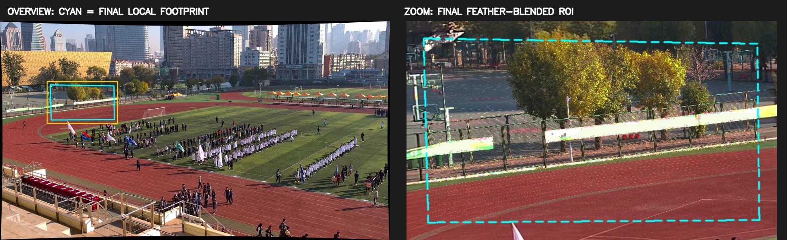
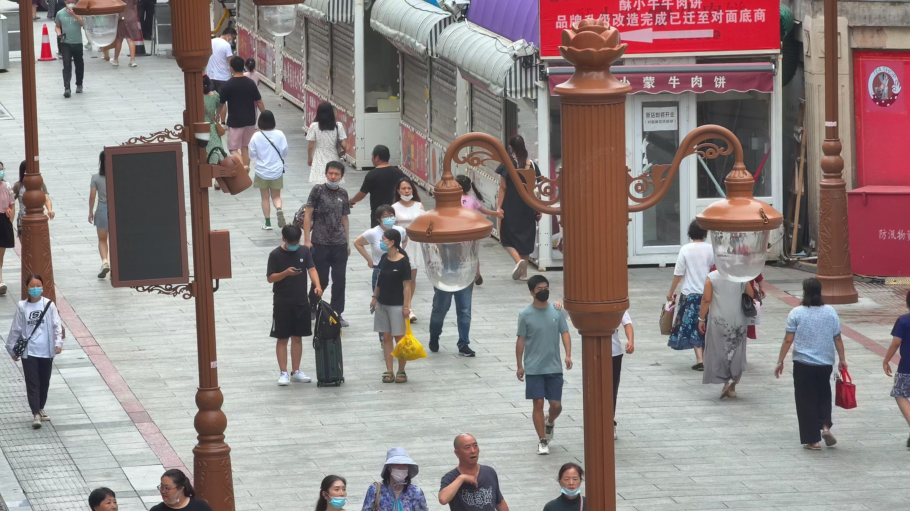
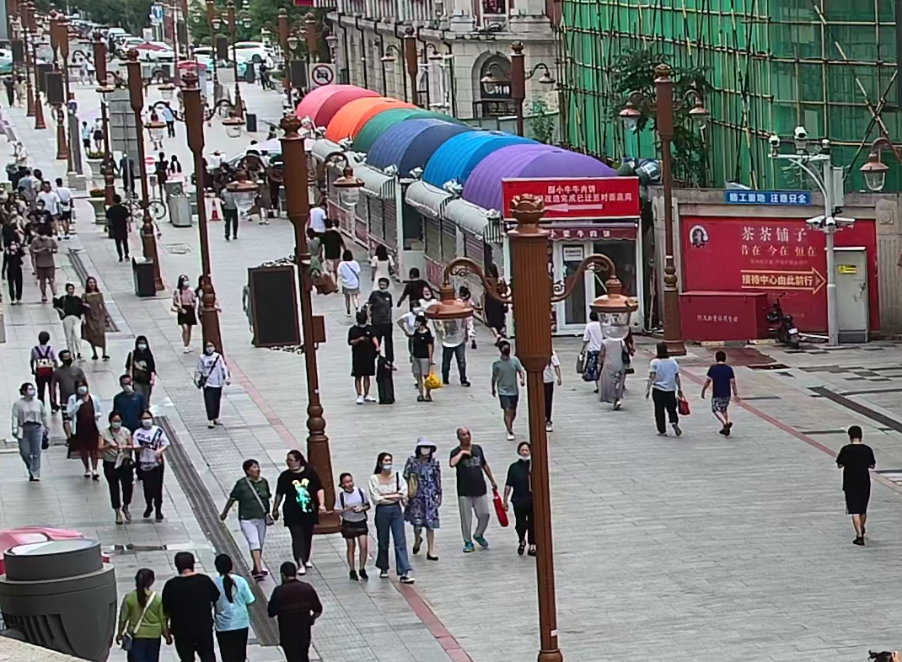

# image_stitch

来自原工程 `image_stitching` 的跨视角图像拼接项目。仓库按算法分为三块；目前前两块有代码、真实输入和可复现输出，视频背景去除留待后续整理。

| 模块 | 用途 | 可运行样例 |
| --- | --- | --- |
| [`image_stitch`](docs/image_stitch.md) | OmniGlue 点匹配 + LineTR 线匹配，估计/精修单应性并羽化拼接 | 运动场、展厅、校园道路各一组图像 |
| [`three_region_stitch`](docs/three_region_stitch.md) | 双视角视频运动掩膜 + 点线运动区单应性 + RAFT 静态区 + Global 背景合图 | 商街人群双视角 200 帧短视频 |
| `video_background_removal` | 视频背景去除 | 后续加入 |

## 1. 纯点线单应性拼接

输入是 Local 和 Global 两张图像，可选相机标定初值 `H_init`。输出 `H_final`、投影和羽化融合图。三个不同场景的输入、初值局部放大、点线匹配及最终输出见[纯拼接样例说明](docs/image_stitch.md)。



## 2. 运动感知三分区域拼接

### 算法流程

算法把 Local 视角的内容合入 Global 视角，重点处理行人、车辆等动态物体造成的错位和重影。输入包括同步的 Local/Global 图像、相机标定得到的初始单应矩阵 `H_init`，以及两路相机对应的短视频。算法不需要深度图；运动信息来自视频，稠密对齐由 RAFT 光流提供。

1. **建立几何初值**：用 `H_init` 把 Local 映射到 Global 坐标系，作为两视角对齐的起点。
2. **精修运动区域单应性**：进行 Local/Global 点线匹配，并只保留两侧运动掩膜都覆盖到的对应，估计精修后的 `H_final`，用于红色区域的投影。
3. **分别生成运动掩膜**：从 Local 和 Global 短视频中各自提取运动掩膜。将 Local 掩膜投影到 Global 坐标系，并与 Global 掩膜比较；同时检查 Local 投影是否有效。
4. **生成三区归属图**：按下表为 Global 画布中的像素选择来源。蓝色区域还需通过 RAFT 前后向一致性检查；检查失败或没有有效 Local 投影的像素由 Global 保留。
5. **合成输出**：按三区归属合成一张 Global 坐标系下的结果，只在区域交界附近羽化 2 px。

| 可视化颜色 | 区域条件 | 合成来源 |
| --- | --- | --- |
| 红色 | Global 判为运动，投影后的 Local 也判为运动，且 Local 投影有效 | 使用 `H_final` 投影 Local |
| 蓝色 | 其余有效重叠区域，且 RAFT 前后向一致性检查通过 | 使用 RAFT 对齐后的 Local |
| 绿色 | 不属于上述两区，或 Local 投影/RAFT 对齐无效 | 保留 Global |

当前展示这一组商街样例。Local/Global 输入、200 帧 ROI 视频、缓存的掩膜/RAFT 中间结果、最终图和同范围对照均在仓库中。视频是真实相机帧，不是合成运动。详见[三分区域算法、数据与复现](docs/three_region_stitch.md)。

### 商街人群 `20220806141041707_cam11`

| Local 最后一帧 | Global 最后一帧 |
| --- | --- |
|  |  |


## 快速运行

在 Python 3.10–3.12 环境中安装基础包，然后先运行不需下载模型的缓存复现。仓库内缓存的是上述真实视频运行得到的运动掩膜、点线精修矩阵和 RAFT 对齐结果；程序会重新完成三区归属和融合。

```bash
git clone --recursive https://github.com/liuyuxiang1021/image_stitch.git
cd image_stitch
python -m pip install -e .
three-region-stitch --example examples/three_region_stitch/20220806141041707_cam11
```

输出在该样例的 `output/three_region/`：`final_result.jpg` 是无标注最终融合图，`region_overlay_on_global.jpg` 是区域归属，`comparison_focus.jpg` 是同一 ROI 的纯拼接/三分区域并排图，`summary.json` 记录矩阵、运行模式与像素数。可用 `--motion-mode recompute` 从随附视频重新生成两个掩膜；完整点线匹配和 RAFT 重算需要模型安装，命令见[三分区域文档](docs/three_region_stitch.md)。纯拼接运行命令见[纯拼接文档](docs/image_stitch.md)。

## 同场景小规模评测

用相同的最后一帧和 `H_init` 运行纯 OmniGlue + LineTR 单应性拼接、OpenCV SIFT + RANSAC 单应性，以及运动区单应性 + RAFT 静态区。只在三种方法共同有效、且双视角均判为静态的像素上，计算对 Global 帧的 PSNR/SSIM；这衡量**静态重叠区对齐**，不等于整图视觉质量，也不是公开数据集的官方排名。

| 场景 | SIFT + RANSAC | 纯点线 H | 三分区域的 RAFT 静态区 |
| --- | --- | --- | --- |
| 商街人群 | 16.54 dB / 0.528 | 16.75 dB / 0.550 | **18.24 dB / 0.670** |

表内数值由[`scripts/evaluate_three_region.py`](scripts/evaluate_three_region.py)生成；像素数、匹配数、SIFT 输出和精确数值见该样例的 `output/benchmark/`。运动目标没有无遮挡的真值，不能从这些静态区指标推断其融合质量；请同时查看并排图和区域图。

## 仓库结构

```text
src/image_stitch/                # 纯点线单应性与羽化融合
src/three_region_stitch/         # 双运动掩膜、运动区 H、RAFT、三区合图
examples/image_stitch/           # 三组静态图像输入与输出
examples/three_region_stitch/    # 三组双视角视频输入与输出
docs/                            # 算法、数据、评测及运行细节
third_party/                     # 官方 OmniGlue、LineTR、RAFT Git submodules
scripts/                         # 模型准备、样例导出、评测
```

`video_background_removal` 目前没有实现或样例，后续再加入。LineTR 的许可证限制为学术或非营利机构的非商业研究用途，使用前请阅读 [`third_party/LineTR/LICENSE`](third_party/LineTR/LICENSE)。
